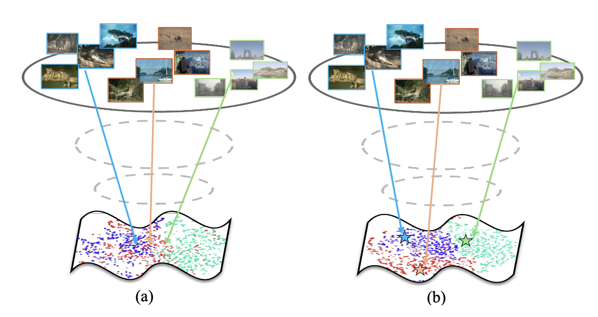
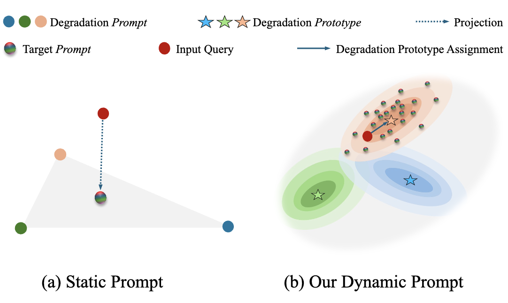
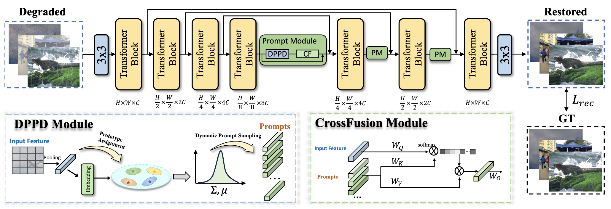
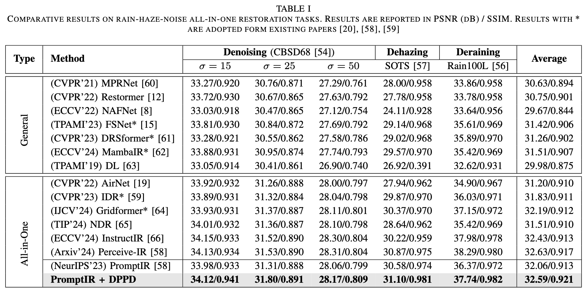
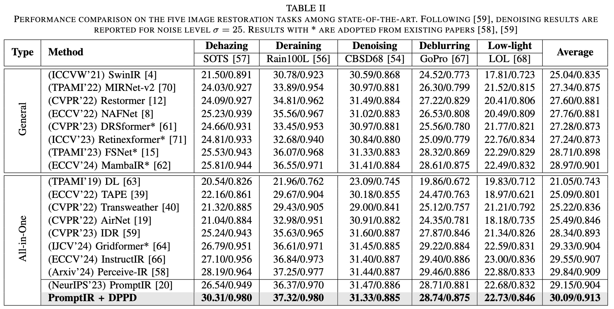
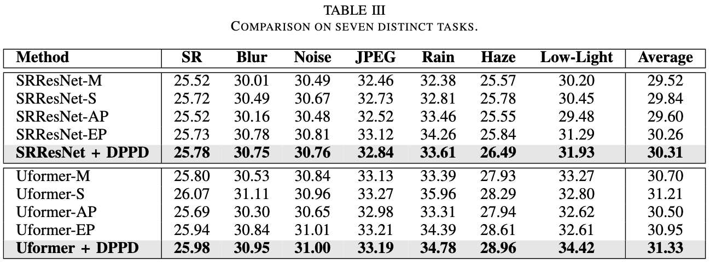
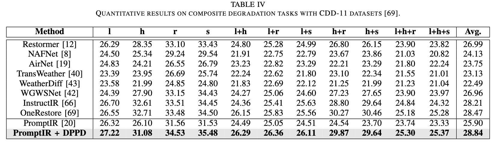

# Learning Dynamic Prompts for All-in-One Image Restoration

[Gang Wu](https://scholar.google.com/citations?user=JSqb7QIAAAAJ), [Junjun Jiang](http://homepage.hit.edu.cn/jiangjunjun)*, [Kui Jiang](https://homepage.hit.edu.cn/jiangkui), [Xianming Liu](http://homepage.hit.edu.cn/xmliu), and [Liqiang Nie](https://liqiangnie.github.io/)

## Overview

> All-in-one image restoration, which seeks to handle multiple types of degradation within a unified model, has become a prominent research topic in computer vision. While existing deep learning models have achieved remarkable success in specific restoration tasks, extending these models to heterogenous degradations presents significant challenges. 
Current all-in-one methods predominantly concentrate on extracting degradation priors, often employing learned and fixed task prompts to guide the restoration process. 
However, these static prompts are inclined to generate an average distribution characteristics of degradations, unable to accurately depict the unique attribute of the given input, consequently providing suboptimal restoration results. To tackle these challenges, we propose a novel dynamic prompt approach called Degradation Prototype Assignment and Prompt Distribution Learning (DPPD). Our approach decouples the degradation prior extraction into two novel components: _Degradation Prototype Assignment_ (DPA) and _Prompt Distribution Learning_ (PDL). DPA anchors the degradation representations to predefined prototypes, providing discriminative and scalable representations. In addition, PDL models prompts as distributions rather than fixed parameters, facilitating dynamic and adaptive prompt sampling.
Extensive experiments demonstrate that our DPPD framework can achieve significant performance improvement on different image restoration tasks.

 <table> <tr> <td align="center"> Degradation Prototype Assignment</td> <td align="center"> Prompt Distribution Learning</td> </tr> </table> 

### Framework

## Datasets

### All-in-One Image Restoration

|Setting| Dataset|
|---|---|
|Noise-Rain-Haze|[WED](http://ivc.uwaterloo.ca/database/WaterlooExploration/exploration_database_and_code.rar),[BSD](https://drive.google.com/file/d/1idKFDkAHJGAFDn1OyXZxsTbOSBx9GS8N/view?usp=sharing),[Rain100L](https://drive.google.com/drive/folders/1-_Tw-LHJF4vh8fpogKgZx1EQ9MhsJI_f?usp=sharing),[OTS](https://sites.google.com/view/reside-dehaze-datasets/reside-v0)|
|CDD-11|[Download](https://github.com/gy65896/OneRestore/tree/main)|

## Results

 
 
 
 

### Download
|Three Task| Rain | Haze | Noise(15, 25, 50)|
|---|---|---|---|
|PromptIR + DPPD| [Download](https://drive.google.com/drive/folders/1RqYkX9kFdsexKQEjuzu42KAZWEogEwD1?usp=sharing)|[Download](https://drive.google.com/drive/folders/1RqYkX9kFdsexKQEjuzu42KAZWEogEwD1?usp=sharing)|[Download](https://drive.google.com/drive/folders/1RqYkX9kFdsexKQEjuzu42KAZWEogEwD1?usp=sharing)|

|Five Task| Rain | Haze | Noise| GoPro| LOL|
|---|---|---|---|---|---|
|PromptIR + DPPD| [Download](https://drive.google.com/drive/folders/1VwvQIIjYv1hbJt_nXkkxNR2zN9lt5Drh?usp=sharing)|[Download](https://drive.google.com/drive/folders/1VwvQIIjYv1hbJt_nXkkxNR2zN9lt5Drh?usp=sharing)|[Download](https://drive.google.com/drive/folders/1VwvQIIjYv1hbJt_nXkkxNR2zN9lt5Drh?usp=sharing)|[Download](https://drive.google.com/drive/folders/1VwvQIIjYv1hbJt_nXkkxNR2zN9lt5Drh?usp=sharing)|[Download](https://drive.google.com/drive/folders/1VwvQIIjYv1hbJt_nXkkxNR2zN9lt5Drh?usp=sharing)|

|Composite Degradation| Results|
|---|---|
|PromptIR + DPPD| [Download](https://drive.google.com/drive/folders/1LR4ndSTzg_lYPK0Nr3R1VETPY9PnYps_?usp=sharing)|
